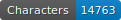
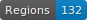
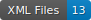

# transcription_Bel-Air

Ce dépôt est dédié à la validation du séminaire [Bibliothèques numériques, I. Gestion de projet (conception, partage, archivage)](https://pgc.unige.ch/main/teachings/details/2025-32M7128?year=2025&fac=default-value).

    

Pour ce projet nous avons utilisé [**eScriptorium**](https://fondue.unige.ch/) pour transcrire 12 pages d'un cahier manuscrit qui en compte 250 environ.

## Manuscrit

Le document choisi s'intitule : _Procès - Verbal de la commission Bel-Air - Commencé le 9 juillet 1907. Terminé le 9 mai 1916._

Et nous avons transcrit les pages 183 à 194.

## Commentaires

Les commentaires sur la transcription sont consultables [ICI](https://github.com/mroylem/transcription_Bel-Air/blob/main/Commentaires%20de%20la%20transcription.md)

## Comment citer

cf. [`htr-united.yml`](https://github.com/mroylem/transcription_Bel-Air/blob/main/htr-united.yml) file.

## Licences

Annotation is CC-BY. Images belong to the digital libraries.

 